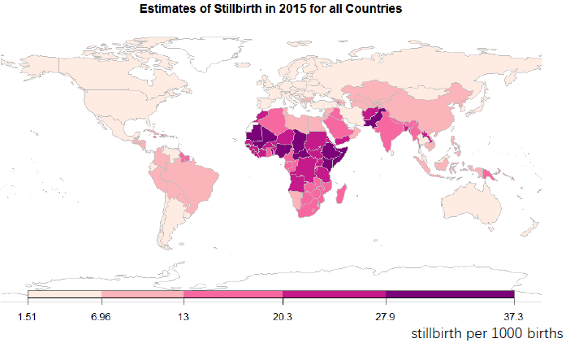

## Welcome to Zhengfan's Pages

---

### Research 

<a href="https://arxiv.org/abs/2010.03551">Bayesian Hierarchical Temporal Sparse Regression Model: Estimation of Stillbirth Rate</a>

 We developed a Bayesian hierarchical temporal sparse regressionmodel for estimating stillbirth rates for all countries from 2000 to 2019. The model combines covariates with a temporal smoothing process so that estimates are data-driven in country-periods with high-quality data and determined by covariates for country-periods with limited or no data. Horseshoepriors are used to encourage sparseness. The model is used by the UN Inter-agency Group for Child Mortality Estimation to monitor the stillbirth rate for all countries. The work is supported by the Bill & Melinda Gates Foundation, UNICEF, and the National Institute of Environmental Health Sciences of the National Institutes of Health. The work is submitted to AOAS and under review. 

---

<a> Bayesian Reference Distribution Variable Selection method based on Horseshoe prior </a>

 Horseshoe prior is a Bayesian sparsity prior that encourages shrinkage towards zero of regression coefficients of irrelevant predictors. 
Although the use of horseshoe priors can result in models with good predictive performance, posterior samples in the resulting model fit are not shrunk to zero exactly to inform the exclusion of irrelevant covariates (like LASSO) and obtain a more parsimonious model to be used for predictions. We propose a new approach for variable selection that is based on model fits using horseshoe priors. In the proposed set up, we introduce noise covariates in the model of interest to obtain a distribution of a shrinkage parameter for irrelevant covariates. For each candidate covariate in the model of interest, we propose an exclusion rule based on comparing the estimate shrinkage for the candidate covariate to the distribution obtained from the noise covariates. We use a simulation study to assess the predictive performance of the proposed approach. 

---
<a href= "https://www.longdom.org/open-access/computation-of-the-properties-of-multistage-clinical-trial-design-basedon-scprt-2167-0870-1000274.pdf"> Computation of the Properties of Multi-Stage Clinical Trial Design Based on SCPRT </a>

Multi-stage clinical trial allows the trial to stop early for pronounced treatment effect or the lack of it thereof based on data accumulated at the intermediate stage. The sequential conditional probability ratio test (SCPRT) approach is derived based on the concept of discordance probability, namely, the probability that the decision to accept or reject the null hypothesis based on interim data would reverse should the trial continue to the planned end. However, in the existing SCPRTs, the discordance probability, type I error and power are not easy to compute. Here we investigate a simulation based method to compute these quantities and apply them to a real data problem as an illustration.

---
### Research interest

My training and research have focused on Bayesian modeling, variable selection, temporal smoothing process/stochastic processes, high dimensional longitudinal data, and clinical trial design. My current research interests include Bayesian modeling, variable selection methods, the linkage between Bayes and frequentist procedures, infectious disease data like COVID19 or HIV, stochastic processes.

---
### Publications and Presentations

- Wang, Z., Fix, M. J., Hug, L., Mishra, A., You, D., Blencowe, H., ... & Alkema, L. (2020). Estimating the Stillbirth Rate for 195 Countries Using A Bayesian Sparse Regression Model with Temporal Smoothing. arXiv preprint arXiv:2010.03551.
- Wang, Z., Yuan, A., & Tan, M. T. (2016). Computation of the Properties of Multi-Stage Clinical Trial Design Based on SCPRT. J Clin Trials, 6(274), 2167-0870.
- Jian-Yu, E., Wang, Z., Ssekasanvu, J., Munoz, B., West, S., Ludigo, J., ... & Kong, X. (2021). Visual Impairment and Eye Diseases in HIV-infected People in the Antiretroviral Therapy (ART) Era in Rakai, Uganda. Ophthalmic Epidemiology, 28(1), 63-69.
- Wang, Z., Stillbirth rate estimation model (Presentation. Core Stillbirth Estimation Group Meeting UN Inter-agency Group for Child Mortality Estimation Meeting. Online. Dec 2020.)
- Wang, Z., Alkema, L. Imposing Sparseness in a Bayesian Hierarchical Regression Model with Temporal Smoothing via the Horseshoe prior with an Application to Estimate Stillbirths for All Countries. (Paper presentation. JSM. Aug. 2020)
- Wang, Z., Estimation of stillbirth rate (Presentation. Second Core Stillbirth Estimation Group Meeting UN Inter-agency Group for Child Mortality Estimation Meeting. New York. July 2019) 
- Wang, Z., Kong, X. Multivariate Longitudinal Data from Eyes – Microperimertry Macular Sensitivity Loss in Patients with Stargardt Disease. (Poster presentation. JSM. Denver, CO. July 2019)
- Wang, Z. Alkema, L. Estimating Stillbirth Rates for all Countries from 2000 Till 2017 using a Bayesian Temporal Hierarchical Regression Model. (Poster presentation. NESS. Hartford, CT. May 2019)
- Wang, Z., Alkema, L. Stillbirth estimation model (Presentation. Core Stillbirth Estimation Group Meeting UN Inter-agency Group for Child Mortality Estimation Meeting. Montreux, Switzerland. Mar 2019)
- Hannallah, M. S., Lopatin, J., Cestare, T., Tefera, E., Wang, Z., & Cai, L. Mixing Lidocaine and Propofol Decreases the Severity but not the Incidence of Propofol Pain on Injection Compared to Injecting Lidocaine Before Propofol in Non-Premedicated Patients Undergoing Colonoscopy. (Washington, DC. Oct 2015)
 
---

---

